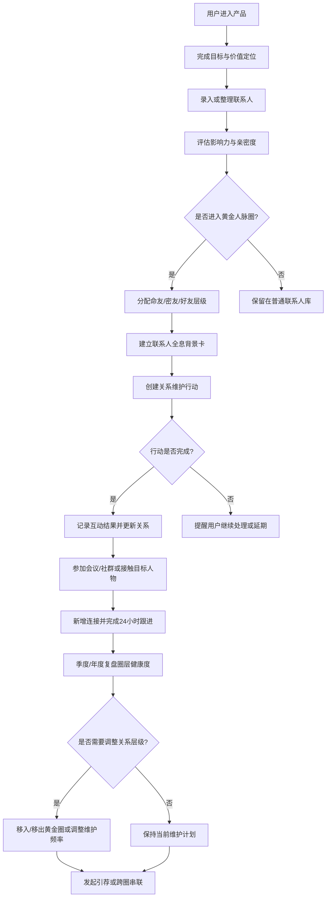
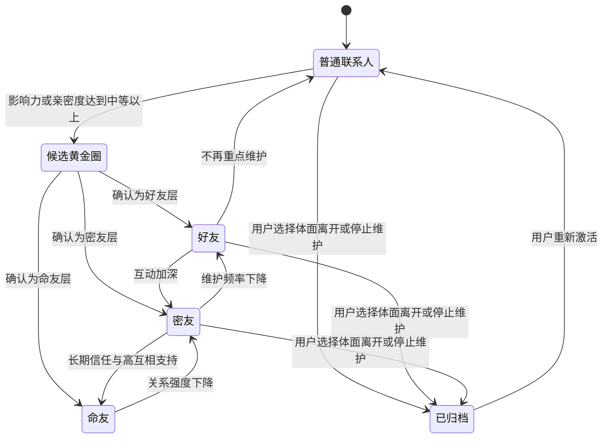
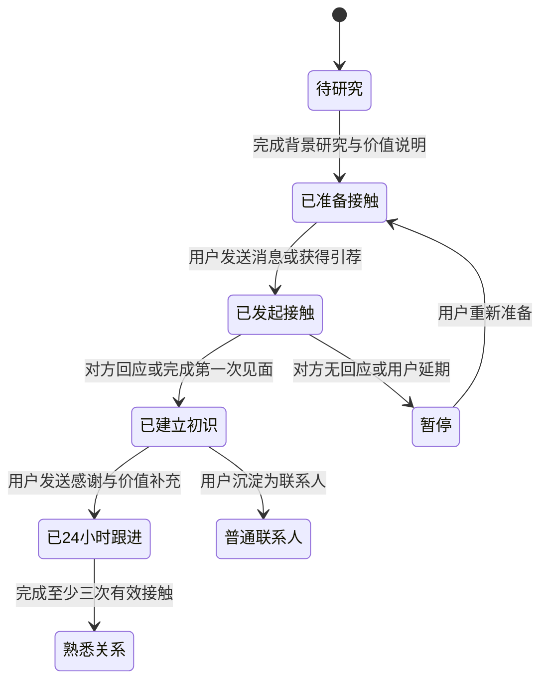
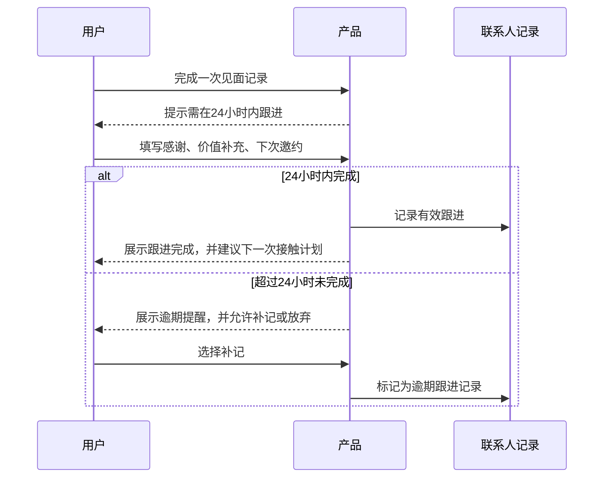

# 产品需求文档：Peigen Nexus / 培根人脉星图 - V1.0

## 1. 综述 (Overview)
### 1.1 项目背景与核心问题
本产品面向希望系统化经营人际关系的个人用户，尤其是处于职业发展、创业合作、销售咨询、个人品牌建设、社群运营等场景中的用户。

当前核心问题是：用户通常知道“人脉重要”，但缺少一套可执行、可复盘、可持续的管理系统。关系维护依赖记忆，联系人缺少分层，目标人物接触缺少准备，会议和社群带来的连接缺少后续跟进，跨圈引荐也缺少明确流程。

本产品将《怎样成为人脉管理的高手》中的方法落地为工具流程，帮助用户完成从目标定位、联系人归档、分层维护、增值行动、目标人物跟进、会议社群拓展，到圈层更新与跨圈串联的完整闭环。

产品假设：
1. V1.0 形态为个人使用的 Web/App 工具。
2. 用户主要手动录入和维护联系人，不默认接入通讯录、微信、LinkedIn 等外部平台。
3. 产品重点是方法落地与行动提醒，不做企业 CRM 的销售漏斗、合同、商机金额等功能。
4. 涉及联系人隐私的信息均由用户主动录入，系统只提供结构化记录与提醒。

### 1.2 核心业务流程 / 用户旅程地图
1. **阶段一：目标与价值定位** - 用户明确自己想做什么、服务谁、对方需要什么、自己能带来什么改变。
2. **阶段二：联系人盘点归档** - 用户录入已有联系人，形成可检索、可分类、可复盘的人脉库。
3. **阶段三：人脉分层筛选** - 用户按影响力和亲密度筛选命友、密友、好友，建立 155 人黄金人脉圈。
4. **阶段四：重要联系人背景卡** - 用户为重点联系人记录全息背景，形成连续关系记忆。
5. **阶段五：关系维护与增值行动** - 用户通过欣赏、分享、陪伴、推荐、支持、保护等动作维护关系。
6. **阶段六：目标人物接触与跟进** - 用户找到目标人物，准备接触话术，完成初次见面和 24 小时跟进。
7. **阶段七：会议/社群拓展连接** - 用户通过会议、活动、社群扩大连接面，并将新连接沉淀为联系人。
8. **阶段八：圈层更新与跨圈串联** - 用户定期复盘关系健康度，更新圈层，并通过引荐形成跨圈连接。

### 1.3 Mermaid 图（流程/状态/时序）
#### 1.3.1 用户操作流（必填）


#### 1.3.2 状态机（当存在明确状态流转对象时必填）
联系人关系状态：


目标人物接触状态：


#### 1.3.3 关键场景时序（仅当“时序/并发/重试/超时”影响用户可见结果时填写）


## 2. 用户故事详述 (User Stories)

### 阶段一：目标与价值定位

---

#### **US-01: 作为个人用户，我希望通过四步追问法明确目标与价值，以便于决定自己应该连接谁**
* **价值陈述 (Value Statement)**:
  * **作为** 个人用户
  * **我希望** 通过四步追问法填写目标、服务对象、对方需求和价值改变
  * **以便于** 后续联系人筛选、目标人物接触和社群选择都有明确方向
* **业务规则与逻辑 (Business Logic)**:
  1. **前置条件**: 用户已进入产品并创建个人空间。
  2. **操作流程 (Happy Path)**:
     1. 用户进入“目标定位”页面。
     2. 系统依次展示四个问题：我想做什么、我服务谁、他们真正缺什么、因为我他们会发生什么改变。
     3. 用户填写答案后，系统生成“目标方向”“个人标签”“价值主张”三项摘要。
     4. 用户可编辑摘要并保存为当前阶段的定位版本。
  3. **异常处理 (Error Handling)**:
     1. 若用户未填写必填问题，保存时提示“请先完成四步追问，再生成定位摘要”。
     2. 若用户只填写部分内容，允许保存草稿，但不生成正式定位摘要。
     3. 若用户已有旧版本定位，新保存内容成为当前版本，旧内容保留为历史记录。
* **验收标准 (Acceptance Criteria)**:
  * **场景1: 成功生成定位摘要**
    * **GIVEN** 用户已填写四步追问的全部问题
    * **WHEN** 用户点击“生成定位”
    * **THEN** 系统展示目标方向、个人标签、价值主张，并允许用户保存
  * **场景2: 必填内容缺失**
    * **GIVEN** 用户至少有一个问题未填写
    * **WHEN** 用户点击“生成定位”
    * **THEN** 系统提示“请先完成四步追问，再生成定位摘要”
* **页面布局线框图 (ASCII Wireframe)**:
```text
+--------------------------------------------------+
| 人脉管理工具 / 目标定位                           |
+--------------------------------------------------+
| 四步追问法                                       |
| 1. 我想做什么？                                  |
| [______________________________________________] |
| 2. 我服务谁？                                    |
| [______________________________________________] |
| 3. 他们真正缺什么？                              |
| [______________________________________________] |
| 4. 因为我，他们会发生什么改变？                  |
| [______________________________________________] |
|                                                  |
| [保存草稿] [生成定位]                            |
+--------------------------------------------------+
| 生成结果                                         |
| 目标方向：...                                    |
| 个人标签：...                                    |
| 价值主张：...                                    |
| [编辑] [保存为当前定位]                          |
+--------------------------------------------------+
```

### 阶段二：联系人盘点归档

---

#### **US-02: 作为个人用户，我希望建立人脉归档表，以便于看见和管理已有关系**
* **价值陈述 (Value Statement)**:
  * **作为** 个人用户
  * **我希望** 录入联系人并按角色、职业、地区、行业、影响力、亲密度归档
  * **以便于** 识别已有资源、发现被忽略的温暖名字，并为分层维护做准备
* **业务规则与逻辑 (Business Logic)**:
  1. **前置条件**: 用户已进入联系人库。
  2. **操作流程 (Happy Path)**:
     1. 用户点击“新增联系人”。
     2. 系统展示联系人基础字段：名字、角色、职业、地区、行业、影响力、亲密度、来源备注。
     3. 用户保存后，联系人出现在归档表。
     4. 用户可按工作/生活、地区、行业、影响力、亲密度筛选。
  3. **异常处理 (Error Handling)**:
     1. 名字为空时不允许保存。
     2. 影响力和亲密度未填写时，联系人可保存，但标记为“待评估”。
     3. 若新增联系人与已有联系人同名，系统提示“可能存在重复联系人”，用户可继续保存或合并。
* **验收标准 (Acceptance Criteria)**:
  * **场景1: 新增联系人成功**
    * **GIVEN** 用户填写了联系人名字和至少一个补充字段
    * **WHEN** 用户点击“保存”
    * **THEN** 联系人出现在归档表中
  * **场景2: 联系人未评估**
    * **GIVEN** 用户未填写影响力或亲密度
    * **WHEN** 用户保存联系人
    * **THEN** 系统将该联系人标记为“待评估”
  * **场景3: 重复联系人提醒**
    * **GIVEN** 已存在同名联系人
    * **WHEN** 用户新增相同名字的联系人
    * **THEN** 系统提示可能重复，并提供“继续保存”和“查看已有联系人”
* **页面布局线框图 (ASCII Wireframe)**:
```text
+--------------------------------------------------------------------------------+
| 联系人归档表                                      [新增联系人] [筛选] [搜索]     |
+--------------------------------------------------------------------------------+
| 筛选：关系来源 [全部 v] 地区 [全部 v] 行业 [全部 v] 状态 [全部 v]               |
+--------------------------------------------------------------------------------+
| 名字     | 角色   | 职业       | 地区 | 行业 | 影响力 | 亲密度 | 状态          |
|----------|--------|------------|------|------|--------|--------|---------------|
| 张三     | 同学   | 产品经理   | 上海 | 互联网 | 中     | 高     | 已评估        |
| 李四     | 前同事 | 投资经理   | 北京 | 金融   | 高     | 中     | 已评估        |
| 王五     | 活动认识 | 运营负责人 | 深圳 | 社群   | -      | -      | 待评估        |
+--------------------------------------------------------------------------------+
| 统计：工作相关 18 人 / 兴趣爱好 9 人 / 金融 4 人 / 媒体 3 人                    |
+--------------------------------------------------------------------------------+
```

### 阶段三：人脉分层筛选

---

#### **US-03: 作为个人用户，我希望圈出 155 人黄金人脉圈，以便于分层投入时间和精力**
* **价值陈述 (Value Statement)**:
  * **作为** 个人用户
  * **我希望** 按命友 5 人、密友 50 人、好友 100 人建立黄金人脉圈
  * **以便于** 把有限时间优先配置给高价值关系
* **业务规则与逻辑 (Business Logic)**:
  1. **前置条件**: 联系人已录入，并已评估影响力和亲密度。
  2. **操作流程 (Happy Path)**:
     1. 用户进入“黄金圈”页面。
     2. 系统展示符合候选规则的联系人：只要不是“影响力弱 + 关系疏”，即可进入候选。
     3. 用户将联系人分配为命友、密友、好友或暂不进入黄金圈。
     4. 系统展示各层级人数和建议维护频率。
  3. **异常处理 (Error Handling)**:
     1. 当命友超过 5 人、密友超过 50 人、好友超过 100 人时，系统提示超过建议容量，但不强制阻止。
     2. 待评估联系人不可直接进入黄金圈，需先补全影响力和亲密度。
     3. 用户可将联系人移出黄金圈，移出后保留历史层级记录。
* **验收标准 (Acceptance Criteria)**:
  * **场景1: 联系人进入黄金圈**
    * **GIVEN** 联系人影响力或亲密度达到中等以上
    * **WHEN** 用户选择其为好友、密友或命友
    * **THEN** 系统将其加入对应层级，并展示维护频率
  * **场景2: 待评估联系人不可分层**
    * **GIVEN** 联系人缺少影响力或亲密度
    * **WHEN** 用户尝试加入黄金圈
    * **THEN** 系统提示“请先完成影响力和亲密度评估”
* **页面布局线框图 (ASCII Wireframe)**:
```text
+----------------------------------------------------------------------------+
| 155 人黄金人脉圈                                                            |
+----------------------------------------------------------------------------+
| 命友 3/5        密友 18/50        好友 42/100        候选 26                |
+----------------------------------------------------------------------------+
| 候选联系人                                                                  |
| 名字   | 影响力 | 亲密度 | 推荐原因                    | 操作              |
|--------|--------|--------|-----------------------------|-------------------|
| 张三   | 中     | 高     | 亲密度达到中等以上          | [命友][密友][好友]|
| 李四   | 高     | 中     | 影响力达到中等以上          | [命友][密友][好友]|
| 王五   | 弱     | 疏     | 不建议进入黄金圈            | [保留普通联系人]  |
+----------------------------------------------------------------------------+
| 维护建议：命友持续在场 / 密友每周互动 / 好友每月联系                         |
+----------------------------------------------------------------------------+
```

### 阶段四：重要联系人背景卡

---

#### **US-04: 作为个人用户，我希望为重要联系人建立全息背景卡，以便于让关系从散点变成连续的线**
* **价值陈述 (Value Statement)**:
  * **作为** 个人用户
  * **我希望** 记录重要联系人的爱好、家庭、重要日期、第一次见面、共同认识的人和目标
  * **以便于** 在后续互动中做到精准关心和持续跟进
* **业务规则与逻辑 (Business Logic)**:
  1. **前置条件**: 联系人已存在。
  2. **操作流程 (Happy Path)**:
     1. 用户进入联系人详情。
     2. 用户点击“编辑背景卡”。
     3. 系统展示结构化字段：基础背景、爱好、家庭成员、重要日期、第一次见面、共同认识的人、对方目标、交流细节、可提供价值。
     4. 用户保存后，背景卡展示在联系人详情页。
  3. **异常处理 (Error Handling)**:
     1. 背景卡允许部分为空，但系统提示“信息越完整，后续维护越精准”。
     2. 重要日期到期前，系统可生成提醒。
     3. 若用户记录敏感信息，系统不主动判断内容，只提醒“请确保记录内容仅用于正当关系维护”。
* **验收标准 (Acceptance Criteria)**:
  * **场景1: 保存背景卡**
    * **GIVEN** 用户已打开联系人详情
    * **WHEN** 用户填写背景卡并保存
    * **THEN** 系统在联系人详情中展示该背景卡
  * **场景2: 重要日期提醒**
    * **GIVEN** 背景卡中存在生日或关键纪念日
    * **WHEN** 日期临近
    * **THEN** 系统在维护任务中生成提醒
* **页面布局线框图 (ASCII Wireframe)**:
```text
+--------------------------------------------------------------+
| 联系人详情：张三                         [编辑] [新增互动]    |
+--------------------------------------------------------------+
| 层级：密友       影响力：中       亲密度：高                  |
| 维护频率：每周一次互动       下次建议：本周五                 |
+--------------------------------------------------------------+
| 全息背景卡                                                   |
| 爱好：跑步、播客                                             |
| 家庭成员：...                                                |
| 重要日期：生日 05-20                                         |
| 第一次见面：2025 年行业活动                                  |
| 共同认识的人：李四、王五                                     |
| 对方目标：转型做 AI 产品                                     |
| 可提供价值：推荐行业资料、介绍产品负责人                     |
+--------------------------------------------------------------+
| 互动时间线                                                   |
| 2026-04-20 分享资料                                          |
| 2026-04-10 线下咖啡                                          |
+--------------------------------------------------------------+
```

### 阶段五：关系维护与增值行动

---

#### **US-05: 作为个人用户，我希望创建关系维护行动，以便于持续给重要联系人提供价值**
* **价值陈述 (Value Statement)**:
  * **作为** 个人用户
  * **我希望** 根据欣赏、分享、陪伴、推荐、支持、保护六个动作创建维护任务
  * **以便于** 让关系维护从随机想起变成持续行动
* **业务规则与逻辑 (Business Logic)**:
  1. **前置条件**: 联系人已存在，且可选是否属于黄金圈。
  2. **操作流程 (Happy Path)**:
     1. 用户从联系人详情或维护看板创建行动。
     2. 用户选择行动类型：欣赏、分享、陪伴、推荐、支持、保护。
     3. 用户填写行动内容、计划时间、期望结果。
     4. 到期后系统提醒用户完成、延期或取消。
     5. 用户完成行动后记录反馈，系统写入互动时间线。
  3. **异常处理 (Error Handling)**:
     1. 任务逾期后显示在“逾期维护”区域。
     2. 用户取消任务时需选择原因：不合适、已通过其他方式完成、暂不维护。
     3. 若同一联系人短期内任务过多，系统提示“维护频率较高，请注意自然和边界”。
* **验收标准 (Acceptance Criteria)**:
  * **场景1: 创建维护任务**
    * **GIVEN** 用户已选择联系人
    * **WHEN** 用户填写行动类型、内容和计划时间并保存
    * **THEN** 系统在维护看板中生成任务
  * **场景2: 完成维护任务**
    * **GIVEN** 维护任务处于待完成状态
    * **WHEN** 用户点击完成并填写反馈
    * **THEN** 系统将任务标记为已完成，并写入联系人互动时间线
  * **场景3: 任务逾期**
    * **GIVEN** 当前时间超过计划时间
    * **WHEN** 用户进入维护看板
    * **THEN** 系统将任务展示在逾期区域，并提供延期或完成操作
* **页面布局线框图 (ASCII Wireframe)**:
```text
+--------------------------------------------------------------------------------+
| 关系维护看板                                      [新增维护行动]                 |
+--------------------------------------------------------------------------------+
| 今日待办                                                                       |
| 联系人 | 层级 | 行动类型 | 内容                         | 操作                 |
|--------|------|----------|------------------------------|----------------------|
| 张三   | 密友 | 分享     | 分享 AI 产品资料              | [完成] [延期] [取消] |
| 李四   | 好友 | 推荐     | 推荐一场金融行业活动          | [完成] [延期] [取消] |
+--------------------------------------------------------------------------------+
| 逾期维护                                                                       |
| 王五   | 好友 | 支持     | 询问项目进展并提供建议        | [补记] [延期] [取消] |
+--------------------------------------------------------------------------------+
| 本周建议：命友 2 人待联系 / 密友 7 人待互动 / 好友 15 人待月度维护              |
+--------------------------------------------------------------------------------+
```

### 阶段六：目标人物接触与跟进

---

#### **US-06: 作为个人用户，我希望管理目标人物接触流程，以便于把陌生人逐步变成熟悉关系**
* **价值陈述 (Value Statement)**:
  * **作为** 个人用户
  * **我希望** 记录目标人物研究、接触话术、见面机会和 24 小时跟进
  * **以便于** 用有准备、有价值、有节奏的方式建立新关系
* **业务规则与逻辑 (Business Logic)**:
  1. **前置条件**: 用户已明确目标定位，且创建目标人物记录。
  2. **操作流程 (Happy Path)**:
     1. 用户新增目标人物。
     2. 用户填写背景研究：对方是谁、仰慕点、对方可能需要什么、自己能提供什么价值。
     3. 系统生成接触准备清单：你是谁、你具体仰慕什么、你能带来什么价值。
     4. 用户记录接触方式和初次见面结果。
     5. 系统创建 24 小时跟进任务，要求包含感谢、价值补充、完整联系方式和下次邀约。
     6. 完成至少三次有效接触后，用户可将目标人物转为联系人。
  3. **异常处理 (Error Handling)**:
     1. 未完成背景研究时，系统提示“建议先完成接触准备，避免低质量打扰”。
     2. 对方拒绝或无回应时，用户可标记暂停，并记录原因。
     3. 24 小时跟进逾期时，系统仍允许补记，但标记为逾期跟进。
* **验收标准 (Acceptance Criteria)**:
  * **场景1: 完成接触准备**
    * **GIVEN** 用户已填写目标人物背景和价值说明
    * **WHEN** 用户保存准备清单
    * **THEN** 系统将目标人物状态更新为“已准备接触”
  * **场景2: 初次见面后生成跟进任务**
    * **GIVEN** 用户记录了第一次见面
    * **WHEN** 用户保存见面记录
    * **THEN** 系统自动生成 24 小时跟进任务
  * **场景3: 对方拒绝**
    * **GIVEN** 用户已发起接触
    * **WHEN** 用户标记对方拒绝或无回应
    * **THEN** 系统将目标人物状态标记为暂停，并保留后续重新接触入口
* **页面布局线框图 (ASCII Wireframe)**:
```text
+--------------------------------------------------------------------------+
| 目标人物：赵六                                      状态：已准备接触      |
+--------------------------------------------------------------------------+
| 背景研究                                                                 |
| 对方是谁：[________________________________________]                      |
| 具体仰慕点：[______________________________________]                      |
| 对方可能需要：[____________________________________]                      |
| 我能提供的价值：[__________________________________]                      |
+--------------------------------------------------------------------------+
| 接触准备清单                                                             |
| 1. 我是谁：...                                                           |
| 2. 我仰慕他什么：...                                                     |
| 3. 我能带来什么价值：...                                                 |
| [保存准备] [记录接触]                                                     |
+--------------------------------------------------------------------------+
| 跟进计划                                                                 |
| 第一次见面：未记录                                                       |
| 24 小时跟进：待生成                                                      |
| 三次接触进度：0/3                                                        |
+--------------------------------------------------------------------------+
```

### 阶段七：会议/社群拓展连接

---

#### **US-07: 作为个人用户，我希望管理会议和社群拓展计划，以便于高效率扩大连接面**
* **价值陈述 (Value Statement)**:
  * **作为** 个人用户
  * **我希望** 按会前、会中、会后记录会议和社群行动
  * **以便于** 让活动中的新连接被沉淀、跟进和长期维护
* **业务规则与逻辑 (Business Logic)**:
  1. **前置条件**: 用户准备参加会议、活动或运营社群。
  2. **操作流程 (Happy Path)**:
     1. 用户创建会议/社群计划。
     2. 会前填写：活动主题、目标人物、调研信息、希望获得的连接。
     3. 会中记录：核心人物、对话要点、可提供价值、后续承诺。
     4. 会后生成待跟进联系人和 24 小时再次联系任务。
     5. 用户可将新认识的人转入联系人库并建立背景卡。
  3. **异常处理 (Error Handling)**:
     1. 若用户只记录活动但未新增联系人，系统提示“是否有值得沉淀的新连接？”
     2. 若会后跟进逾期，系统展示补记入口。
     3. 若活动与用户目标定位无关，系统不阻止，但提示“该活动可能不符合当前目标方向”。
* **验收标准 (Acceptance Criteria)**:
  * **场景1: 创建会议计划**
    * **GIVEN** 用户填写活动名称和时间
    * **WHEN** 用户保存计划
    * **THEN** 系统生成会前、会中、会后三段任务
  * **场景2: 会后沉淀联系人**
    * **GIVEN** 用户记录了活动中认识的人
    * **WHEN** 用户点击“转为联系人”
    * **THEN** 系统将其加入联系人库，并关联活动来源
  * **场景3: 活动目标不清**
    * **GIVEN** 用户未填写希望获得的连接
    * **WHEN** 用户保存会前计划
    * **THEN** 系统提示“建议明确本次活动的连接目标”
* **页面布局线框图 (ASCII Wireframe)**:
```text
+----------------------------------------------------------------------------+
| 会议/社群计划：AI 产品闭门会                          [保存] [完成活动]     |
+----------------------------------------------------------------------------+
| 会前准备                                                                    |
| 活动主题：[____________________]  时间：[__________]                        |
| 目标人物：[____________________]                                            |
| 希望获得的连接：[________________________________________________]          |
| 调研信息：[______________________________________________________]          |
+----------------------------------------------------------------------------+
| 会中记录                                                                    |
| 新认识的人 | 对话要点 | 可提供价值 | 后续承诺 | 操作                         |
|------------|----------|------------|----------|------------------------------|
| 陈七       | ...      | 推荐资料   | 发邮件   | [转为联系人] [生成跟进]      |
+----------------------------------------------------------------------------+
| 会后任务                                                                    |
| [ ] 24 小时内再次联系陈七                                                    |
| [ ] 为陈七建立背景卡                                                        |
+----------------------------------------------------------------------------+
```

### 阶段八：圈层更新与跨圈串联

---

#### **US-08: 作为个人用户，我希望定期复盘圈层并管理引荐，以便于保持人脉系统健康并放大网络价值**
* **价值陈述 (Value Statement)**:
  * **作为** 个人用户
  * **我希望** 定期更新黄金圈、识别耗能关系，并管理跨圈引荐
  * **以便于** 保持关系网络健康，并成为能连接资源、信息和人物的串联者
* **业务规则与逻辑 (Business Logic)**:
  1. **前置条件**: 用户已有联系人、黄金圈和互动记录。
  2. **操作流程 (Happy Path)**:
     1. 用户进入季度/年度复盘。
     2. 系统展示各层级联系人互动频率、逾期维护、关系变化建议。
     3. 用户选择维持、升级、降级、移出黄金圈或归档。
     4. 用户创建引荐任务，分别确认双方是否愿意认识。
     5. 双方确认后，用户记录口头引荐、书面说明和后续反馈。
  3. **异常处理 (Error Handling)**:
     1. 若任一方未确认愿意识别，系统提示不应推进引荐。
     2. 若引荐后无反馈，系统提醒用户跟进进展。
     3. 移出黄金圈不删除联系人，仅调整维护策略。
* **验收标准 (Acceptance Criteria)**:
  * **场景1: 调整联系人层级**
    * **GIVEN** 用户进入复盘页面
    * **WHEN** 用户将某联系人从密友调整为好友
    * **THEN** 系统更新层级和维护频率，并保留调整记录
  * **场景2: 创建合规引荐**
    * **GIVEN** 用户希望引荐 A 和 B
    * **WHEN** A 和 B 均被标记为愿意识别
    * **THEN** 系统允许用户推进引荐，并生成书面说明模板
  * **场景3: 任一方未确认**
    * **GIVEN** A 或 B 未确认愿意识别
    * **WHEN** 用户尝试推进引荐
    * **THEN** 系统提示“请先确认双方意愿，再进行引荐”
* **页面布局线框图 (ASCII Wireframe)**:
```text
+--------------------------------------------------------------------------------+
| 圈层复盘与串联                                              [新建引荐]          |
+--------------------------------------------------------------------------------+
| 黄金圈健康度                                                                      |
| 命友：3/5  本月互动 3 人     密友：18/50  逾期 4 人     好友：42/100  逾期 12 人 |
+--------------------------------------------------------------------------------+
| 复盘建议                                                                          |
| 联系人 | 当前层级 | 最近互动 | 建议          | 操作                             |
|--------|----------|----------|---------------|----------------------------------|
| 张三   | 密友     | 7 天前   | 维持          | [维持] [升级] [降级] [归档]      |
| 王五   | 好友     | 120 天前 | 降级或归档    | [维持] [降级] [归档]             |
+--------------------------------------------------------------------------------+
| 引荐任务                                                                          |
| A 联系人：[________]  B 联系人：[________]                                       |
| A 是否愿意：是/否     B 是否愿意：是/否                                          |
| 人品担保：[________________]  引荐理由：[________________]                       |
| [生成书面说明] [记录反馈]                                                        |
+--------------------------------------------------------------------------------+
```

## 3. 非目标与边界
1. V1.0 不做企业销售 CRM，不管理合同、报价、回款、商机阶段。
2. V1.0 不自动抓取外部社交平台数据。
3. V1.0 不替用户判断“谁值得交往”，只基于用户输入提供分层和复盘辅助。
4. V1.0 不鼓励操控式社交，所有接触、求助、引荐均以互惠、尊重、边界和双方意愿为原则。

## 4. 待确认事项
1. 产品最终形态需确认：Web、移动 App、小程序、Notion 模板或本地工具。
2. 是否需要联系人数据导入能力，如 CSV、通讯录、LinkedIn 导出文件。
3. 是否需要提醒能力接入系统日历或第三方日历。
4. 是否需要 AI 辅助生成接触话术、跟进消息、复盘建议。
5. 联系人隐私、加密、备份和导出策略需在技术方案阶段进一步明确。
